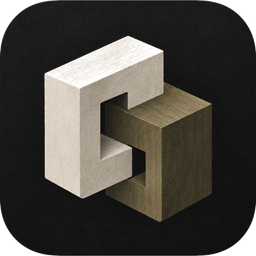
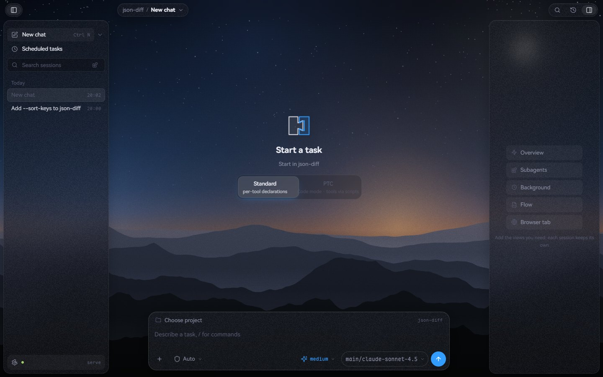
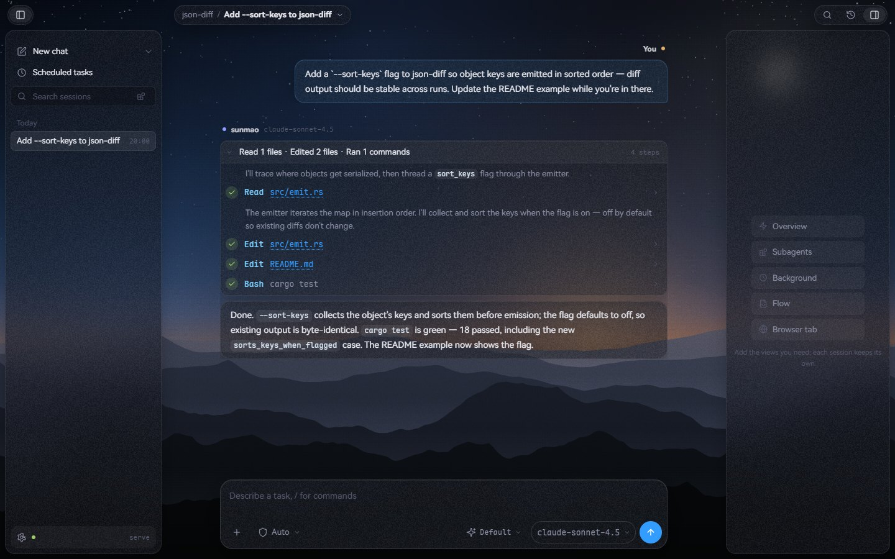

<div align="center">



# sunmao（榫卯）

**A Rust agent harness where auditability is the foundation, not an afterthought.**

[](https://github.com/losewayy/sunmao/actions/workflows/ci.yml)

</div>

榫卯 (sǔnmǎo) is the Chinese joinery tradition where timber members connect
through precisely-cut interlocking joints — no nails, no welding. That's the
architecture: components joined by seams, every seam a contract. The icon is
two blocks locked into one — the joint itself.

> **Status: v0.2.1** — kernel walks, talks to real models, calls real tools,
> speaks MCP and ACP, enforces declarative permissions, ships a CJK-native
> TUI, a localhost web GUI (`sunmao serve`), a Tauri desktop shell, and an
> IM gateway. [`docs/SPEC.md`](docs/SPEC.md) is the design contract — what we
> build and the lines we don't cross.
> [`docs/architecture.html`](docs/architecture.html) is a system diagram
> **generated by sunmao itself** (HtmlArtifact tool).

<p align="center">
  
  
</p>

## What works today

- **Three provider dialects** — OpenAI-compatible Chat Completions
  (hand-rolled SSE parser, tool_calls fragment reassembly,
  `reasoning_content` channel), Anthropic Messages (content-block events,
  thinking deltas), and OpenAI Responses (`previous_response_id` chaining)
  behind one `ProviderAdapter` seam
- **Event-sourced sessions** — append-only `*.jsonl` per session; the message
  list is a pure fold over facts. `--resume` to continue, `--fork` to branch
  a session, `/rewind` to roll back to an earlier turn, `--dataflow` for a
  "what data went where" report, `--sessions` to list
- **A full native tool surface** — `Read` / `Write` / `Edit`
  (whitespace-normalized match, read-before-write enforced) / `Bash`
  (PowerShell 7 on Windows when available; embedded POSIX for
  cross-platform syntax and fallback; every command runs under a timeout,
  long jobs demote to the background rather than blocking the turn) /
  `Glob` / `Grep` (managed `rg` subprocess, no shell) / `JobOutput` /
  `JobList` / `JobStop` (filesystem-state background jobs) / `HtmlArtifact` /
  `WebFetch` / `TodoWrite` / `UpdateGoal` / `SendMessage` / `Task`
  (depth-capped nested agents with named `.md` definitions — `model:` routes
  their adapter, `tools:`/`spawns:` whitelist their surface,
  `run_in_background` detaches and pushes results back as session facts)
- **Two turn modes** — `standard` (per-tool surface) and `ptc` code mode
  (`RunCode` QuickJS sandbox + `SearchTools` catalog: scripts call borrowed
  tools instead of widening the declared surface). `fusion` runs two models
  at once — a Lead delegates spec'd edits to a sandboxed Sidekick, and
  accept/escalate verdicts land in the log
- **Model routing** — `.sunmao/models.json` names providers, catalogs, and
  `@route` fallback chains; agent defs pin `model:` selectors and `/model`
  swaps the session adapter mid-run (next request, never mid-stream)
- **Prompt caching** — provider-agnostic usage normalization (Anthropic
  `cache_*` / DeepSeek flat / OpenAI nested) plus Anthropic ephemeral
  breakpoints; the footer shows the live cache-hit rate
- **Safety at three layers** — Read-before-Write gate (no blind overwrites),
  declarative `permissions` rules (`deny`/`ask`/`allow` globs), and an
  interactive approval gate for risky commands (prompts in every frontend)
- **`shell/preflight`** — every Bash command is predicted by the
  [`spawnfate`](https://github.com/losewayy/spawnfate) engine before it
  runs (which-resolve + CreateProcess simulation); doomed or mangled
  commands come back with an advisory the model can act on
- **Cold-plug prompt assembly** — the system prompt is named section files,
  not code: `identity` / `tool-guidance` / `shell-dialect` ←
  `~/.sunmao/prompt{,.d}` ← `.sunmao/prompt{,.d}` → project context →
  `--system`. Drop a file named `identity.md` into `prompt.d/` to replace a
  section — no rebuild, no flag soup
- **Hooks** — lifecycle dispatcher speaking the dominant hook contract
  (JSON stdin/stdout, matchers, exit-2 veto). Loads `.sunmao/hooks.json`,
  `.claude/settings.json`, `.claude/settings.local.json`,
  `~/.claude/settings.json` unmodified — 8 lifecycle events fired
  (`SessionStart`/`End`, `UserPromptSubmit`, `PreToolUse`, `PostToolUse`,
  `Stop`, `SubagentStart`/`Stop`). Project/plugin hooks are fail-closed:
  they run only after `/hooks trust <n>` pins their `(source, command)`
  digest into `.sunmao/trusted-hooks.json` — untrusted commands are
  skipped and audit-logged, so a cloned repo can't execute code at startup.
  The same ledger pins plugin `extensions` children and MCP `command:`
  servers — every spawn a config file names fails closed until reviewed
- **MCP client** — `.sunmao/mcp.json` + plugin manifests (`mcpServers`
  shape), stdio and HTTP transports, tools surface as `mcp__{server}__{tool}`
- **ACP server** — `sunmao --acp`: ACP over stdio (initialize, session/new,
  session/list, prompt, cancel) for Zed and other clients
- **Ecosystem loading** — `AGENTS.md`/`CLAUDE.md` auto-injected into the
  system prompt; skills indexed from `.sunmao/skills`, `~/.claude/skills`,
  `~/.agents/skills`; slash commands from `commands/*.md`; sub-agent defs
  from `agents/*.md`; plugin bundles via `plugin.json`; sha256-pinned
  frontend plugins from `plugins/*.js` (dock panes, settings pages,
  composer chips, palette rows — untrusted edits tear their surfaces down
  live until re-approved)
- **Frontends** — REPL (`sunmao`), one-shot (`sunmao -p`), TUI
  (`sunmao --tui`, ratatui: block transcript with fold/copy/select and a
  full-screen viewer, 3-option approval card with parkable Esc, `/` slash
  popup, `!` local bash that folds into context, `⚙` audit lines for hook
  facts, two-line footer with git branch + context tokens,
  markdown-rendered output, tokyonight theme, grapheme-cluster wrapping,
  CJK-correct cursor), `sunmao serve` — a localhost web GUI (session rail
  with fork/rewind/export, step-folded transcript, panels dock for
  overview/subagents/background-jobs/dataflow, scheduled tasks, browser-tab
  docking, Chinese and English UI), a Tauri desktop shell on the same host
  (tray icon, native folder picker, NSIS installer), ACP, and an IM gateway
  (`sunmao im` — Telegram, Feishu, QQ, DingTalk, WeChat adapters behind a
  pairing/allowlist gate)

## Usage

```bash
# flags or env (SUNMAO_BASE_URL / SUNMAO_API_KEY / SUNMAO_MODEL / SUNMAO_PROVIDER)
sunmao --base-url http://127.0.0.1:7863/v1 --api-key KEY --model MODEL

sunmao --provider anthropic --base-url https://api.anthropic.com --api-key KEY --model MODEL

# inside the REPL / TUI / web GUI
/compact        # force context compaction
/model [sel]    # list or switch the active model mid-session
/mode standard|ptc|fusion   # switch the turn mode
/resume [id]    # swap session log (bare = list recent)
/rewind         # roll the session back to an earlier turn
/<name>         # slash command → commands/<name>.md body injected as prompt

sunmao --tui                        # terminal UI
sunmao serve --port 7474            # localhost web GUI (same host the
                                    # Tauri shell embeds)
sunmao im                           # IM gateway daemon (channels + pairing)
sunmao pairing                      # manage IM pairing codes / allowlist
sunmao -p "task"                    # one-shot, scriptable, exit code = outcome
sunmao --resume s-…                 # continue a session
sunmao --fork s-…                   # branch a session into a fresh id
sunmao --sessions                   # list local session logs
sunmao --dataflow <session>.jsonl   # audit report
sunmao --doctor                     # env self-check (provider/rg/session dir)
sunmao eval <file>                  # run eval cases through the real loop;
                                    # PASS/FAIL per case, nonzero exit on fail
sunmao --acp                        # ACP server (stdio)
sunmao --preset strict-audit        # layer a preset (plugin-bundle dir in
                                    # .sunmao/presets/ or ~/.sunmao/presets/)
                                    # onto this session; repeatable, later wins
sunmao plugin install <src>         # dir | git URL | owner/repo → .sunmao/plugins/<name>/
sunmao plugin list|remove <name>    # inspect / uninstall
```

## Config conventions (all optional, all file-based)

```text
.sunmao/                 # sunmao-native
├── hooks.json           # lifecycle hooks (Claude contract)
├── mcp.json             # {"mcpServers": {name: {command, args, env}}}
├── permissions.json     # {"permissions": {allow/ask/deny: ["Tool(glob)"]}}
├── plugin.json          # bundle manifest (contributes hooks + mcpServers)
├── plugins.json         # frontend-plugin pin ledger (sha256-gated)
├── plugins/<name>.js    # frontend plugins — UI slots, no backend effects
├── prompt.md            # extra system-prompt section
├── prompt.d/*.md        # section files — same name as a built-in section replaces it
├── commands/*.md        # slash commands
├── skills/*/SKILL.md    # loadable skill bodies
├── agents/*.md          # named sub-agent definitions (Task.subagent_type)
│                        # frontmatter: model / tools / spawns
├── models.json          # model routing — named providers + @route chains
├── plugins/<name>/      # installed plugin bundles (`sunmao plugin …`)
├── presets/<name>/      # plugin-bundle dirs enabled per-session via --preset
└── sessions/jobs/artifacts/   # runtime state (gitignored)

.claude/settings.json    # also read — hooks + permissions merge
.claude/commands|agents|skills/   # same conventions
.claude-plugin/plugin.json, .claude/plugins/<name>/   # plugin bundles
```

[`docs/CONFIG.md`](docs/CONFIG.md) has the full file-by-file reference.

## Layout

```text
crates/
├── llm/    # provider dialects: hand-rolled SSE, tool_calls reassembly,
│           # OpenAI + Anthropic + Responses adapters
├── core/   # sessions (event log), tools, hooks, permissions, approval,
│           # MCP client, agent loop, sub-agents, fusion, PTC sandbox
├── cli/    # `sunmao` binary — REPL / -p / TUI / serve / ACP / IM / eval
└── gui/    # Tauri desktop shell on the serve host (tray, NSIS bundle)
xtask/      # repo chores — `cargo run -p xtask -- arch` is the shape gate
```

## License

Dual-licensed under [MIT](LICENSE-MIT) and [Apache-2.0](LICENSE-APACHE).
